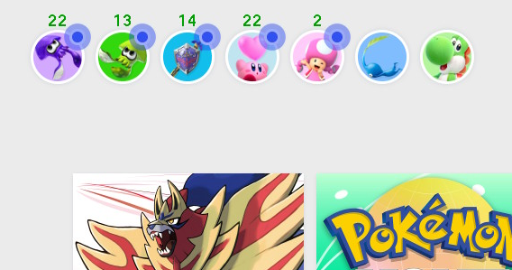

# User Slot Number

The user profile # is used by multiple programs. For the auto-hosts, it needs to be set correctly for friend requests to be accepted on the correct account. For MultiGameFossil, it needs to be set correctly to enter the correct game.
On the Switch Home menu, all the user profiles are at the upper-left corner of the screen.

The left-most user is slot 1. The next one over is slot 2, etc... The Switch allows up to 8 users.

**Back to:**
- [Project Home](/README.md)
- [Documentation Home](/Documentation/README.md)

**Discord Server:** 

