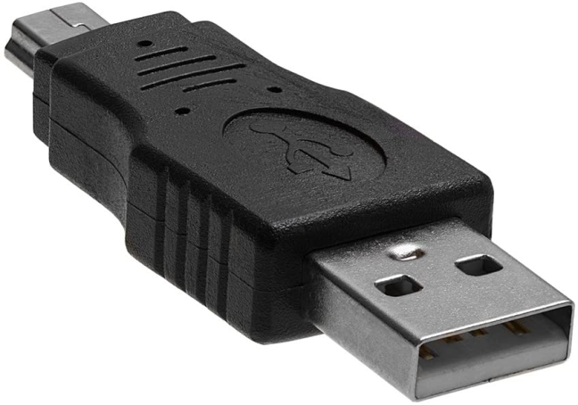
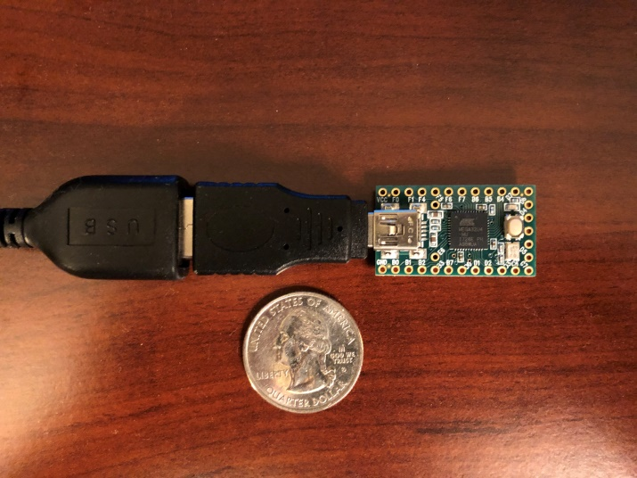

# Hardware and Recommendations

If you are new to automation and are interested in getting started, you will need some hardware.

**Required Hardware:**

First, you will need a board to run the programs. Any of the following are known to work. You can buy them from other retailers such as Amazon.

- Arduino Uno R3 (https://store.arduino.cc/usa/arduino-uno-rev3)
- Teensy 2.0 (https://www.pjrc.com/store/teensy.html)
- Teensy++ 2.0 (https://www.pjrc.com/store/teensypp.html)

Then you will need a way to connect the board both to your computer and to your Switch dock.
- For Arduino, any USB-A male to USB-B male cable will do. ([example](https://www.amazon.com/AmazonBasics-USB-2-0-Cable-Male/dp/B00NH11KIK))
- For Teensy, you will need a mini-USB male to USB-A male cable or adapter. ([example](https://www.amazon.com/Cmple-Pack-Male-5-Pin-Adapter/dp/B00A1PH0ZW))

**Required for Switch Lite:**

If you have a Switch Lite or you want to use the Arduino/Teensy while undocked, you will also need either a USB-A female to USB-C adapter or a USB hub/dock that supports charging:
- USB-A female to USB-C male adapter. ([example](https://www.amazon.com/Syntech-Adapter-Thunderbolt-Compatible-MacBook/dp/B07CVX3516))
- Portable Dock for Nintendo Switch. ([example](https://www.amazon.com/gp/product/B07JK9DFKH)) – also works for Switch Lite

The adapter will let you connect the Arduino/Teensy directly to the Switch, but you will not be able to charge at the same time. A USB hub or portable dock will let you use the Arduino/Teensy and charge at the same time.

**Optional Hardware:**

If you will be using the [FastCodeEntry](FastCodeEntry.md) program or if you are a heavy user in general, then it is strongly recommended to get a USB-A male-to-female cable with a power switch on it. ([example](https://www.amazon.com/gp/product/B07T9BRNHW))

If you intend to change programs very often and will be running the Switch next to a computer, then you will want a USB switch. ([example](https://www.amazon.com/gp/product/B006Z0Q2SI)) These are like USB-only KVM switches. In fact a regular KVM switch will also work. With this, you no longer have to constantly plug/unplug USBs which will eventually wear them down.

## Arduino or Teensy?

As a first time user, you will need to pick a board. Arduino is the most common choice due to price and availability, but Teensy has some major advantages.

**We recommend Teensy 2.0.**

*Arduino Uno R3 is not recommended.*

Teensy++ 2.0 is also fine, but overkill in terms of capability.

### Teensy is Easier to Use:

Teensy 2.0 and Teensy++ 2.0 are much easier use. To put them into flash mode, you simply push the white button. By comparison for Arduino, you need to short two pins with a metal object. If you change programs a lot, this can get very tiring.

Teensy is much smaller than Arduino. When used with an adapter, it effectively becomes a small naked USB flash drive which you can easily plug into the computer or the Switch dock. On the other hand, Arduinos are much larger and will require dealing with an extra cable.

 

### Arduino Uno R3 has Insufficient Memory:

This is a problem that we have run into recent version of this package. The Arduino Uno R3 runs out of memory.

*The Arduino Uno R3 only has 512 bytes of usable memory.*

This is because the programs for Switch automation run on the ATmega16U2 USB controller chip instead of the larger (removable) ATmega328P chip. Or to put it another way, all Switch automation programs that run on Arduino Uno R3 are hacks that are improperly using the Arduino.

In short, 512 bytes of memory is a very low limit. Prior to version 20200911, the [AutoHost-MultiGame](AutoHost-MultiGame.md) program overran this limit. This caused the program to crash for Arduino users. While this has since been rectified with memory optimizations, it is only a short-term fix.

Future versions of this package may include even bigger and more complicated programs that will require more than 512 bytes of memory. Such programs will not be able to run on Arduino Uno R3. Thus if you want to future proof yourself, get Teensy instead of Arduino.

Teensy 2.0 and Teensy++ 2.0 have 2.0KB and 2.5KB of memory respectively. This is more than enough.
