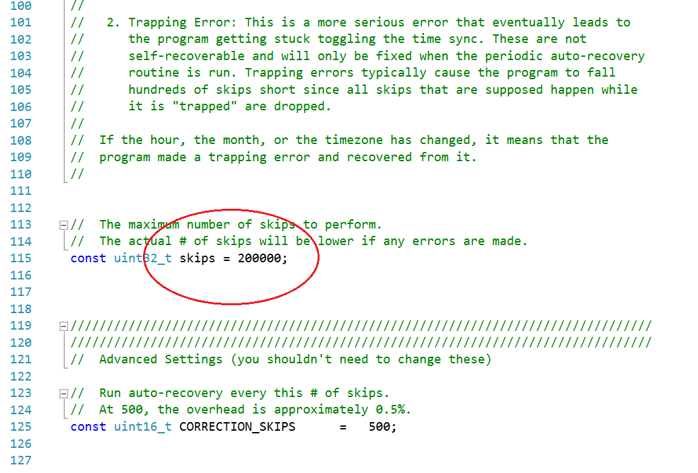
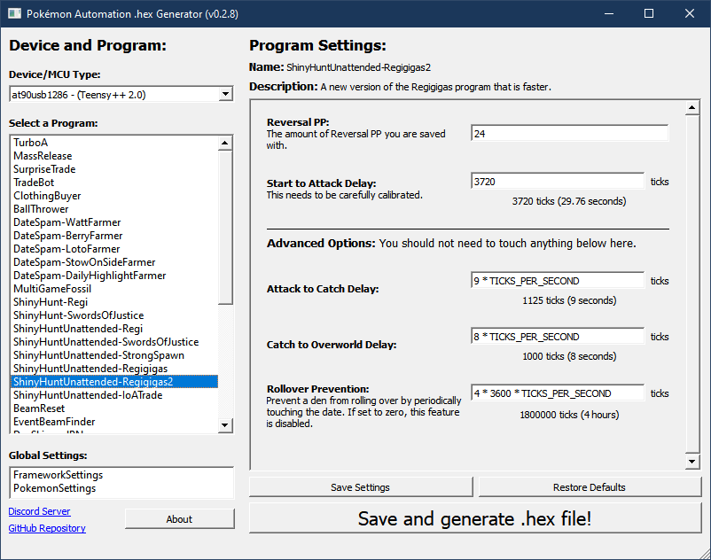
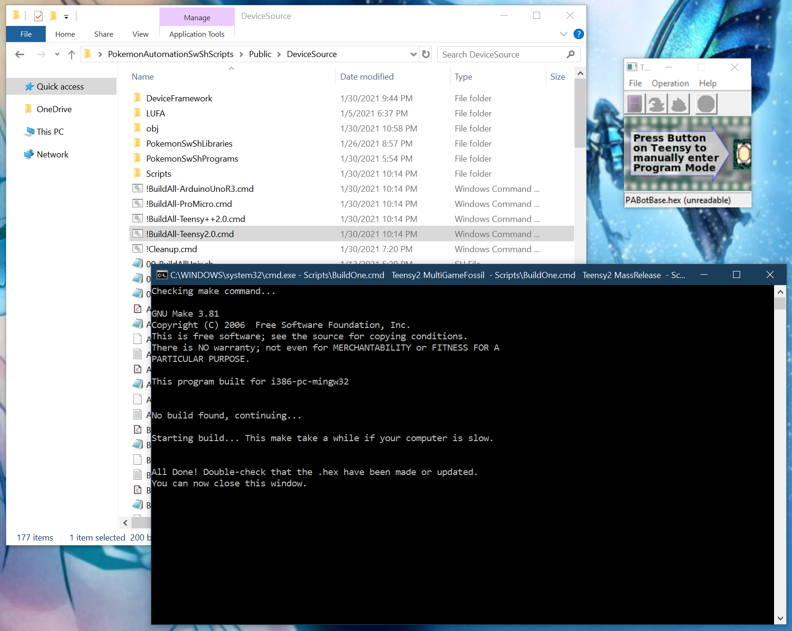
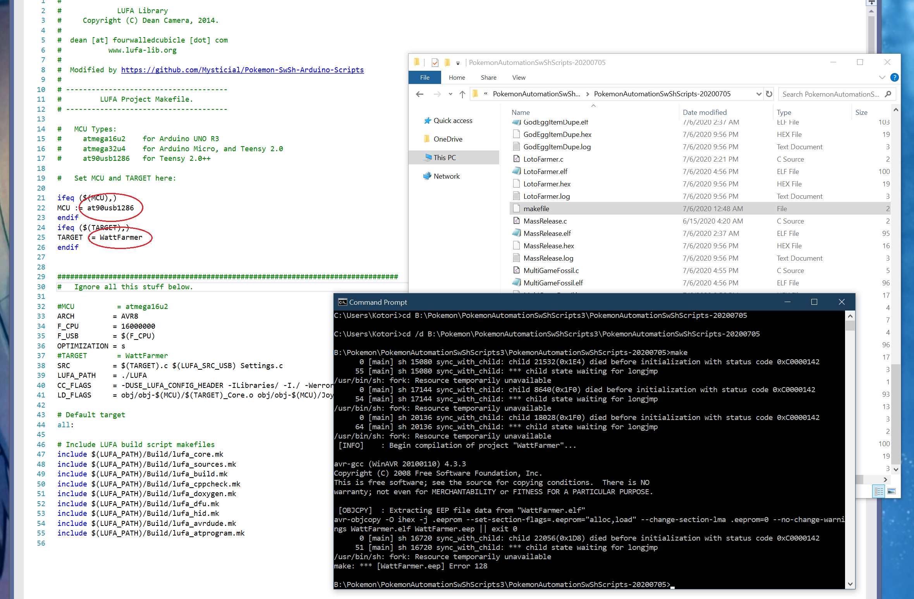
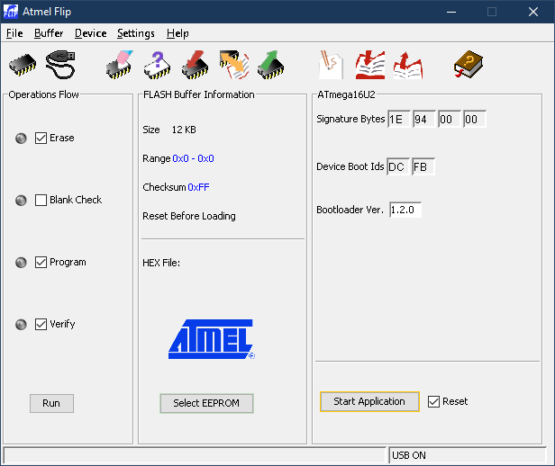
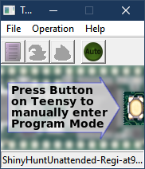

# How to Use

Once you have your hardware, you will need to setup the software. The process for getting a program running on your Switch roughly breaks down to the following. 
1. Install the build tools.
2. Configure and compile the program to create a ".hex" file. This .hex file is the program that you will load into your Arduino or Teensy.
3. Load the program into your Arduino/Teensy using Flip or Teensy Loader.
4. Plug your Arduino/Teensy into your Switch and watch the program run.

Here is an alternate (and very detailed) guide on how to set everything up: https://cdn.discordapp.com/attachments/709951744876216340/788975618552365056/arduinosetupguide1216.pdf

## Install the Build Tools:

**Windows:**
1. Install WinAVR. (https://sourceforge.net/projects/winavr/files/)

**Mac:**
1. Install homebrew.
2. Run “brew tap osx-cross/avr” to install AVR.
3. If the above doesn’t work, try running “brew install avr-gcc” as well.

**Linux:**
Currently untested, instructions TBD.

## Configuring the Programs:

*This step is not needed if you are using the Hex Generator UI program (method 1) - see next section.*

If you are not using the UI program, you will need to manually configure the programs by editing the respective .c files. This process is the same as brianuuuSonic’s AutoController v3.1.0 programs.

For example, if you want to run the 7.8k date-skipper to 5000 skips, open up `DaySkipperJPN_7.8k.c` in a text editor. Edit the `skips` variable to 5000. Then save the file.

## Building the Hex Files:
There are several ways to build .hex files that you need to load into the Arduino/Teensy.

1. [Use the hex generator UI. (Windows only)](#method-1-use-the-hex-generator-ui-windows-only)
2. [Run the BuildAll-xxxx.cmd file. (Windows only)](#method-2-run-the-buildall-xxxxcmd-file-windows-only)
3. [Run the !BuildAllUnix.sh file. (Mac and Linux)](#method-3-run-the-buildallunixsh-file-mac-and-linux)
4. [Run the !FlashUnix.sh file. (Mac and Linux)](#method-4-run-the-flashunixsh-file-mac-and-linux)
5. [Use the makefile.](#method-5-use-the-makefile)

### Method 1: Use the hex generator UI. (Windows only)

This is easiest and the preferred method. It may become available to Mac and Linux in the future.

Double-click on the program "PokemonAutomationUI" to run it. Then select the program you want on the left side. 

The program should be fairly self-explanatory. Once you have selected the options you want, click the button "Save and generate .hex file!" to save your settings and generate the .hex file.

### Method 2: Run the BuildAll-xxxx.cmd file. (Windows only)

Go into the folder “DeviceSource” and you will find 3 BuildAll scripts corresponding to the 4 different board types.
- !BuildAll-ArduinoUnoR3.cmd
- !BuildAll-ProMicro.cmd
- !BuildAll-Teensy2.0.cmd
- !BuildAll-Teensy++2.0.cmd

If you double-click on it, it will build every single program in the package. It should look similar to this:

Depending on how fast your computer is, it may take several seconds or longer to run. Once complete, it will have created .hex files for all the programs. It will tell you if there are any errors.

Errors are logged into the respective .log file for the program (for example "WattFarmer.log"). If you don’t see any .log files, it’s because you have file extensions disabled. In that case, the file will just be named "WattFarmer".

If you are comfortable with shell scripting and you don't want to keep rebuilding all the programs, you can edit "Scripts/BuildAll.cmd" to build only a subset of the programs.

### Method 3: Run the 00-BuildAllUnix.sh file. (Mac and Linux)

Now there are scripts for Mac and Linux as well. The steps here are similar to Windows (Method 1).

Go into the folder "DeviceSource", then you need to run the "00-BuildAllUnix.sh" script:

Mac:
1.	Open Terminal
2.	Type `bash ` (with a trailing space!) Do not hit enter after entering this.
3.	Drag from finder the "00-BuildAllUnix.sh" script into the Terminal Window.
4.	Press enter.
Linux:
1.	Open a terminal.
2.	cd into the same path as the "00-BuildAllUnix.sh" script.
3.	Type `bash 00-BuildAllUnix.sh`
4.	Press enter.

This will build every single program and create .hex files for all of them. If will tell you if there are any errors. 

Errors are logged into the respective .log file for the program (for example "WattFarmer.log").

If you are comfortable with shell scripting and you don’t want to keep rebuilding all the programs, you can edit "Scripts/BuildAllUnix.sh" to build only a subset of the programs.

### Method 4: Run the !FlashUnix.sh file. (Mac and Linux)

This is a do-all script that will build a program and then flash it to your device.

This is recommended for the Arduino. If you have Teensy, you should use the Teensy loader application instead.

Go into the folder "DeviceSource", then you need to run the "00-FlashUnix.sh" script:

**Mac:**
1. Open Terminal
2. Type `bash ` (with a trailing space!) Do not hit enter after entering this.
3. Drag from finder the "00-FlashUnix.sh" script into the Terminal Window.
4. Press enter.

**Linux:**
1. Open a terminal.
2. cd into the same path as the "00-FlashUnix.sh" script.
3. Type `bash 00-FlashUnix.sh`
4. Press enter.

Once you run the script, it will prompt you for:
- The board type.
- Which program to compile and load.

It will automatically build the program and flash it to your device.

### Method 5: Use the makefile.

This method is almost identical to brianuuuSonic's AutoController v3.1.0 programs. Edit the makefile and run `make` to build the .hex file.

In the folder "DeviceSource", open the file "makefile" and edit the `BOARD_TYPE` and `TARGET` manually. Then save the file and run `make` from the command line.

## Load the Program:
Once you have built the .hex file, you must load it into your Arduino or Teensy using FLIP or Teensy Loader respectively. Refer to [brianuuuSonic's video](https://www.youtube.com/watch?v=y2xFf7e_KSU) for how to do this as he explains it fairly well for both Arduino and Teensy on Windows.

For Arduino, you will need FLIP: https://www.microchip.com/developmenttools/ProductDetails/flip

For Teensy, you will need Teensy Loader: https://www.pjrc.com/teensy/loader.html

 

## Run the Program:
On the Switch, navigate to the starting location for the program. Most programs that enter the game will start from the [Grip menu](Appendix/ChangeGripOrderMenu.md). Others will start elsewhere. Refer to the appropriate section in this manual for each program.

Nearly all programs will start with a 5 second delay during which the LEDs will flash for 5 seconds before the program begins running. These 5 seconds give time for KVM setups to switch USB outputs from the computer to the Switch. This can be configured in [FrameworkSettings.c](Appendix/GlobalSettings.md).

If the LEDs do not flash (stays on or off), it means that the device has failed to connect to the Switch.

Some programs will finish, others will run indefinitely. Programs that finish will turn on the LEDs on the Arduino/Teensy to indicate that it is done.

All programs can be safely interrupted at any time by simply unplugging or turning off the Arduino/Teensy. In the end, the Arduino/Teensy is just a controller – one that doesn’t fit in your hand as well as a normal controller or a Joy-Con would.

## While a Program is Running:

When running these Arduino programs, do not do anything that might slow down or jitter the UI or graphics. Many of these programs are very optimized and timing-sensitive. Thus, any unexpected delays or slowdowns in the Switch can cause button presses to be missed and/or mis-timed.

**While a program is running:**
- Do not dock/undock the Switch.
- Do not plug/unplug the HDMI cable.
- Do not switch video inputs on the TV.
- Do not turn on/off the TV.
- Do not plug/unplug the AC power.
- Do not let the Switch overheat. Keep it well ventilated, do not lie it flat on a flat surface since it blocks the vents on the back.

All of these actions will jitter the Switch and introduce timing glitches.

**Recommendations:**
- If you don't want to leave the screen on, dim it all the way down before you start the program.
- Alternatively, use a throw-away monitor/TV that you don't care about.
- Alternatively, start the program with the monitor/TV off or disconnected. All programs that finish will turn on the LEDs to indicate it is done.
- If you absolutely need to mess with the displays while the program is running, do it during long animations or when no buttons are being pressed. (i.e. when an egg is hatching, or when a raid is starting)

The worst time to mess with the displays is during settings navigation.

For programs with fast button presses, it is also recommended to disconnect from the internet and turn on airplane mode if applicable. This reduces network traffic-induced jitter.

