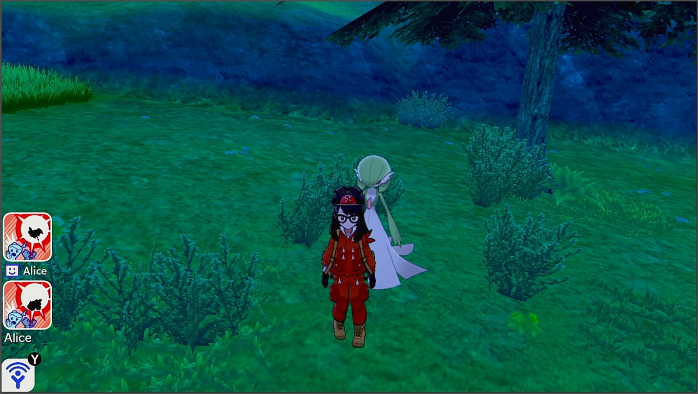
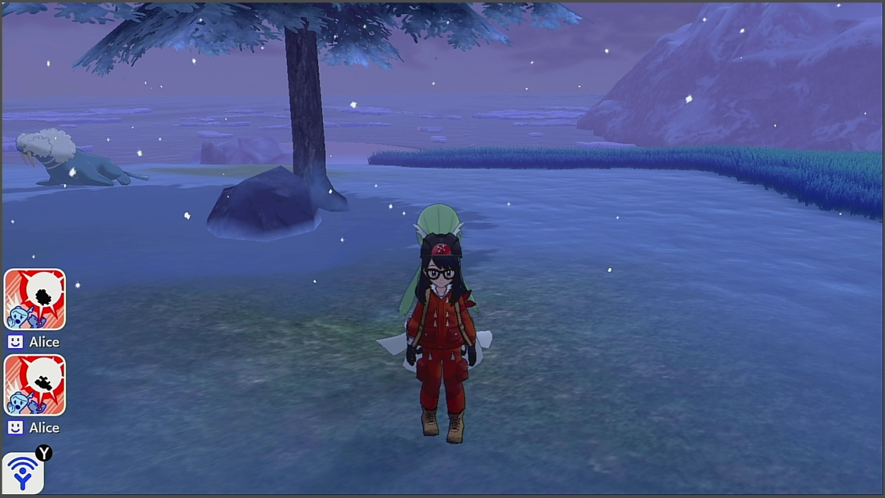

# ShinyHunt-SwordsOfJustice

Soft-reset for a shiny Sword of Justice. This program requires you to watch it since it won’t stop on a shiny.

## Instructions:
- You must have system time unsynced.
- Casual mode is off.
- Your text speed must be set to fast.
- Airplane mode must be off.
- The cursor in the menu is over the "Pokémon Camp" option.
- Your lead Pokémon must be faster than the Sword of Justice. (in order to run away)
- You must have previously defeated or ran away from the Sword of Justice so that it is no longer present.
- You must be standing exactly on the spawn point of the Sword of Justice.
- You must be in the overworld.
-	Start the program in the [Change Grip/Order Menu](../Appendix/ChangeGripOrderMenu.md).

**Additional Recommendations:**
- Make sure your lead Pokémon is not shiny. That way if you hear the shiny sound, you know it’s the Sword of Justice and not your own lead Pokémon.

**Virizion Spawn Point:**



**Cobalion Spawn Point:**



**Terrakion Spawn Point:**


## Serial Output:

More on: [Serial Communication](../SerialCommunication.md)

This program outputs the number of attempted encounters. This can be read using the Device Logger..

## Options:

This program uses [`TOLERATE_SYSTEM_UPDATE_MENU_FAST`](../Appendix/GlobalSettings.md#tolerate-system-update-menu-fast) to bypass the system update window.

### Exit Camp to Run Delay:
```
const uint16_t EXIT_CAMP_TO_RUN_DELAY   =   19 * TICKS_PER_SECOND;
```
This is the delay from when you leave the camp to when you run from the battle. Increase this if you want to give yourself more time to stop the program on a shiny.

### Enter Camp Delay:
```
const uint16_t ENTER_CAMP_DELAY         =   8 * TICKS_PER_SECOND;
```
Wait this long after entering camp before you leave.

### Run Delay:
```
const uint16_t RUN_DELAY                =   5 * TICKS_PER_SECOND;
```
The delay from when you run from the battle to when you bring up the menu to enter the camp.

### Time Rollback:
```
const uint8_t TIME_ROLLBACK_HOURS   =   1;
```
Every this many hours, rollback the time by this many hours. This keeps the time constant to prevent the weather from changing. It also allows you to target time-specific marks. Set this to zero to disable this feature.

This feature will also prevent any unintentional day-skips that will destroy any dens that are on the save file.

