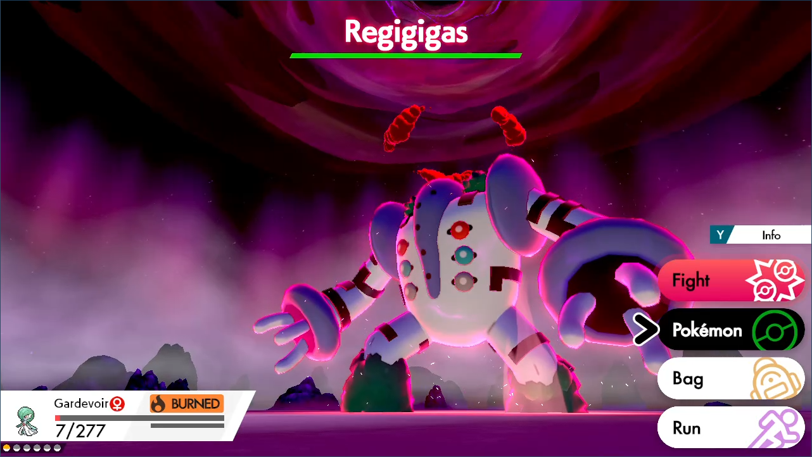

# ShinyHuntUnattended-Regigigas

*There is now a faster version of this program: [ShinyHuntUnattended-Regigigas2](ShinyHuntUnattended-Regigigas2.md)*

Soft-reset for shiny Regigigas. 

[Please read the appendix to understand how unattended shiny-hunting programs work.](../Appendix/UnattendedShinyHuntingPrograms.md)

If you’re here, you are probably experienced with the other unattended reset programs. As a warning, the Regigigas program is by far the most difficult and complicated to setup. And to top it off, it is also the slowest.

This program does one encounter every ~2 minutes. This leads to 5.5 day odds for a shiny. If you intend to square hunt with this program, average time is 3 months on one Switch. Therefore, this program will be a test of patience.

***Warning, this program may require calibration. The default settings are not guaranteed to work on your Switch. Read the instructions here carefully and be patient. Hardly anybody gets it right the first time.***

When correctly calibrated:
- If the encounter is not shiny, the program will black out and move on to the next encounter.
- If the encounter is shiny, the program will trap itself inside the Pokémon menu. This allows you to manually back out and fight the shiny Regigigas.



## Instructions:

As mentioned in the introduction, this program has an extremely complicated setup. The key is that it requires you to black out in one turn.

**Instructions:**
- You must have system time unsynced.
- Casual mode is off.
- Your text speed must be set to fast.
- Battle animations are off.
- Airplane mode must be off.
- The game save has been online at least once before.
- Your lead Pokémon must not have high happiness. The in-battle shaking and dialog adds timing variation.
- The last place you healed is in Freezington. You cannot respawn in a Pokémon center after blacking out.
- *All but one Pokémon in your party must be fainted. Your non-fainted Pokémon MUST die in one turn.*
- You must be stocked up on potions and revives so that you can heal and actually defeat Regigigas.
- You must be saved in front of the Regigigas den.
- You must be in the overworld. (not inside the menu)
- Start the program in the [Change Grip/Order Menu](../Appendix/ChangeGripOrderMenu.md).


The screenshot above shows what your party should look like. Note that the burn on the non-fainted Pokémon ensures that it dies in one turn. Once you encounter a shiny, you need to immediately heal.

**Additional Recommendations (to normalize timings):**
•	Your lead Pokémon is not shiny.
•	Your lead Pokémon does not have an ability that activates upon entry to battle.

The speed of this program is heavily affected by how quickly the program can reset the game. By default, the soft-reset timings are very loose to ensure that they work on the most Switches. You can optimize this by going into `PokemonSettings.c` and adjusting `START_GAME_WAIT` and `ENTER_GAME_WAIT`.

## Calibration:

Before you continue, first read the appendix on unattended shiny-hunting calibration to better understand how the process works.

Section: [Unattended Shiny-Hunting Calibration](../Appendix/UnattendedShinyHuntingPrograms.md#calibration)

The variable that controls the critical delay for this program is `START_TO_ATTACK_DELAY`.
- When the encounter is not shiny, the LEDs will turn on ***0.5 – 1.5 seconds AFTER*** the battle menu appears. The program will attack Regigigas, black out of the battle, and return to Freezington.
- When the encounter is shiny, the LEDs will turn on ***0.5 – 1.0 seconds BEFORE*** the battle menu appears. The program will not attack and will instead trap itself in the summary of your Pokémon.

Make only small changes at a time, no more than +/- 50 ticks at a time. Most Switches will have a working value somewhere between 3650 and 3800. Each tick is 8 milliseconds. (125 ticks per second)

## Serial Output:

More on: [Serial Communication](../SerialCommunication.md)

This program outputs the number of attempted encounters. This can be read by the serial programs.

## Options:

This program uses [`TOLERATE_SYSTEM_UPDATE_MENU_FAST`](../Appendix/GlobalSettings.md#tolerate-system-update-menu-fast) to bypass the system update window.

### Start to Attack Delay:
```
const uint16_t START_TO_ATTACK_DELAY    =   3720;
```
This is the delay from when talk to the den to when you attack Regigigas. This is the critical parameter that needs to be properly calibrated.

### Rollover Prevention:
```
const uint32_t TOUCH_DATE_INTERVAL = (uint32_t)4 * 3600 * TICKS_PER_SECOND;  //  4 hours
```
This is useful if your game is holding a den and you do not want an unintentional date-skip to destroy it.

Prevent the den from rolling over by periodically touching the date at this interval. Set this value to zero to disable the feature.


## Advanced Settings:
These are advanced settings. You shouldn’t need to touch these unless something isn’t working and you’re trying to debug it yourself.


### End Battle Delay:
```
const uint16_t END_BATTLE_DELAY         =   22 * TICKS_PER_SECOND;
```
After attacking Regigigas, wait this long for the program to return to the overworld.


<hr>

**Back to:**
- [Project Home](/README.md)
- [Program List](/Documentation/ProgramList.md)

**Discord Server:** 

[](https://discord.gg/cQ4gWxN)
