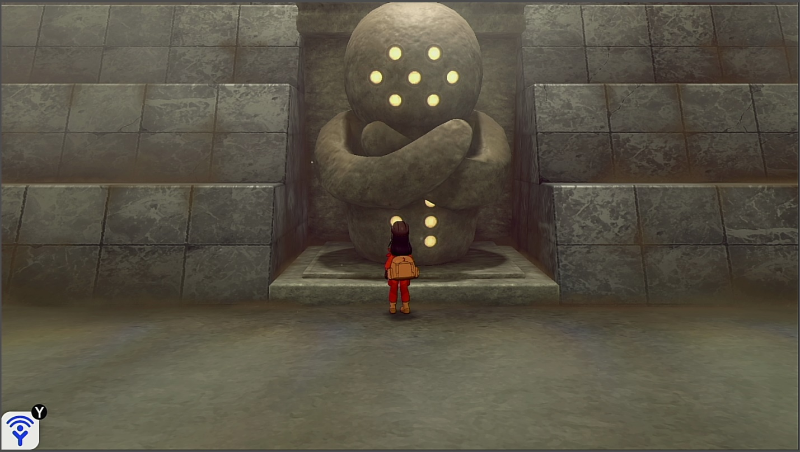

# ShinyHunt-Regi

Soft-reset for a shiny Regi golem. This program requires you to watch it since it won’t stop on a shiny.



## Instructions:
- You must have system time unsynced.
- Casual mode is off.
- Your text speed must be set to fast.
- You must have 7 or more badges or you cannot catch the Regi.
- You must be standing in front of and facing the Regi statue with the lights activated.
- You must be saved in the above position.
-	Start the program in the [Change Grip/Order Menu](../Appendix/ChangeGripOrderMenu.md).

**Additional Recommendations:**
- Make sure your lead Pokémon is not shiny. That way if you hear the shiny sound, you know it’s the Regi and not your own lead Pokémon.

## Serial Output:

More on: [Serial Communication](../SerialCommunication.md)

This program outputs the number of attempted encounters. This can be read using the Device Logger.

## Options:

This program uses [`TOLERATE_SYSTEM_UPDATE_MENU_FAST`](../Appendix/GlobalSettings.md#tolerate-system-update-menu-fast) to bypass the system update window.

### Wait Time:
```
const uint16_t WAIT_TIME    =   12 * TICKS_PER_SECOND;
```
Wait this long after initiating the battle before resetting.

### Rollover Prevention:
```
const uint32_t TOUCH_DATE_INTERVAL = (uint32_t)4 * 3600 * TICKS_PER_SECOND;  //  4 hours
```
This is useful if your game is holding a den and you do not want an unintentional date-skip to destroy it.

Prevent the den from rolling over by periodically touching the date at this interval.

Set this value to zero to disable the feature.
