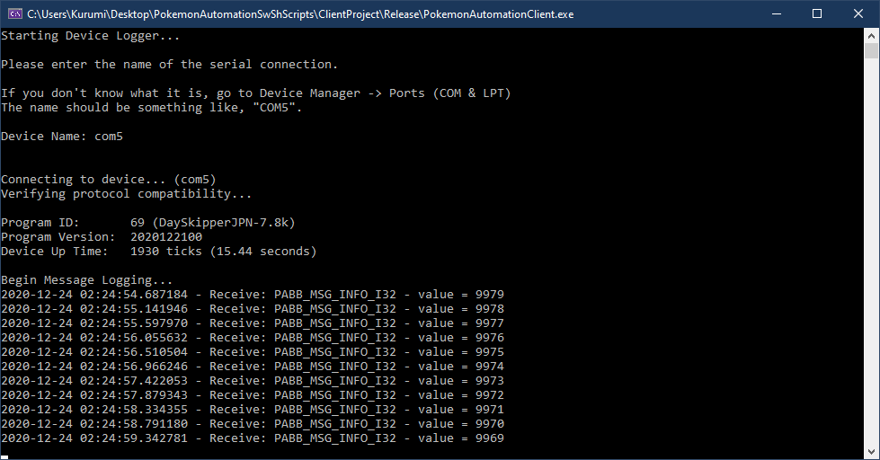
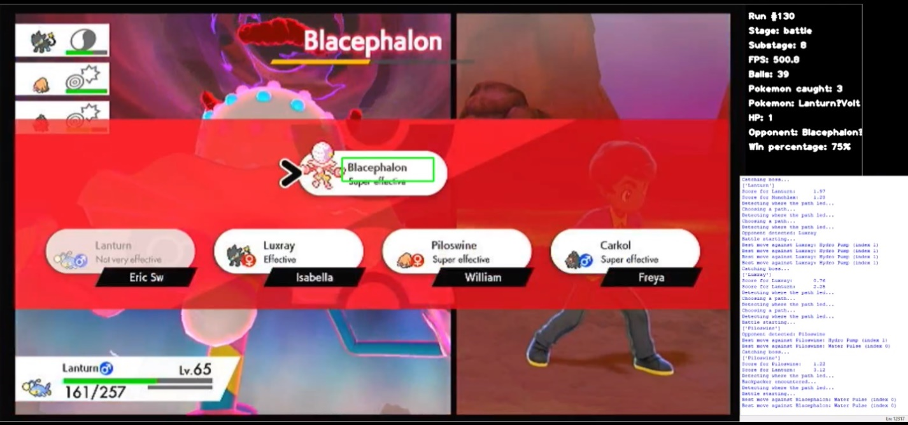
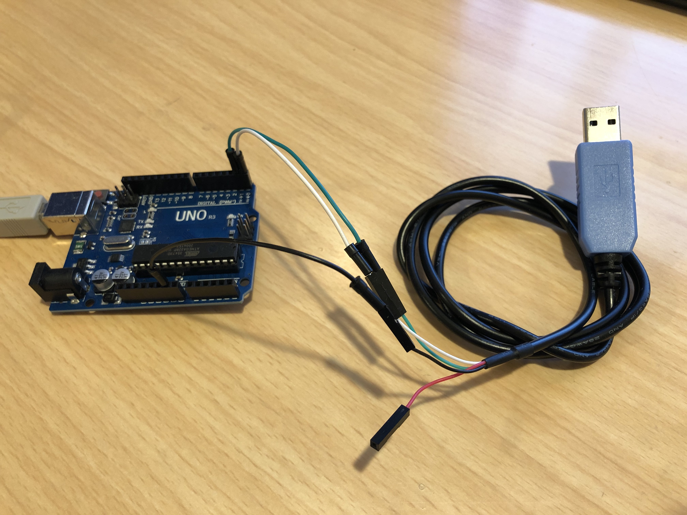
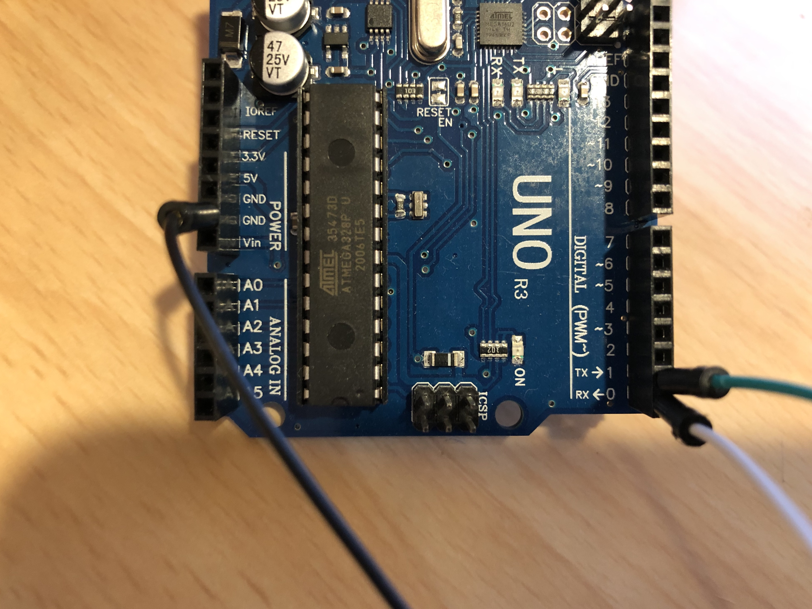
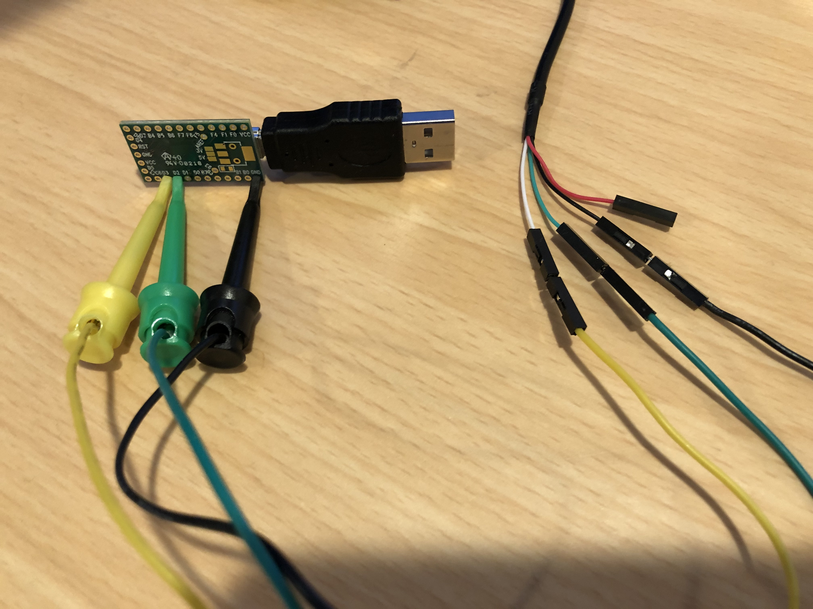
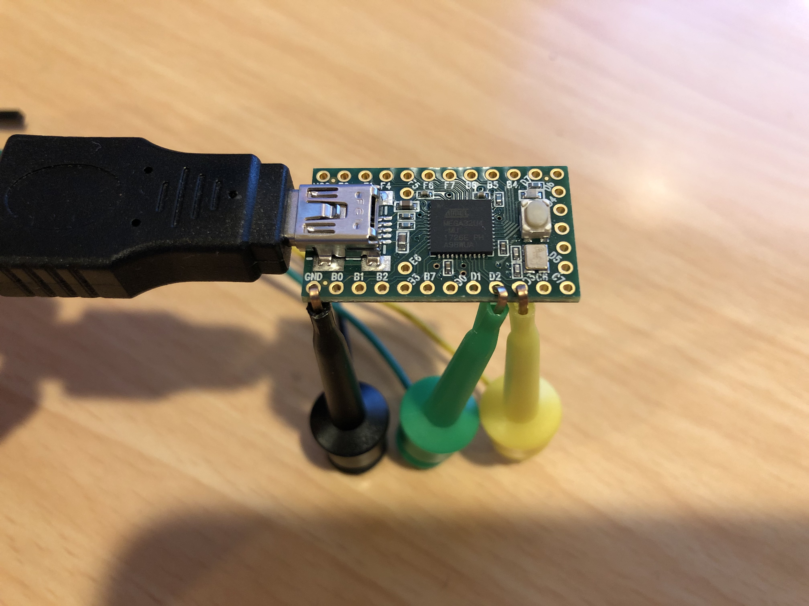
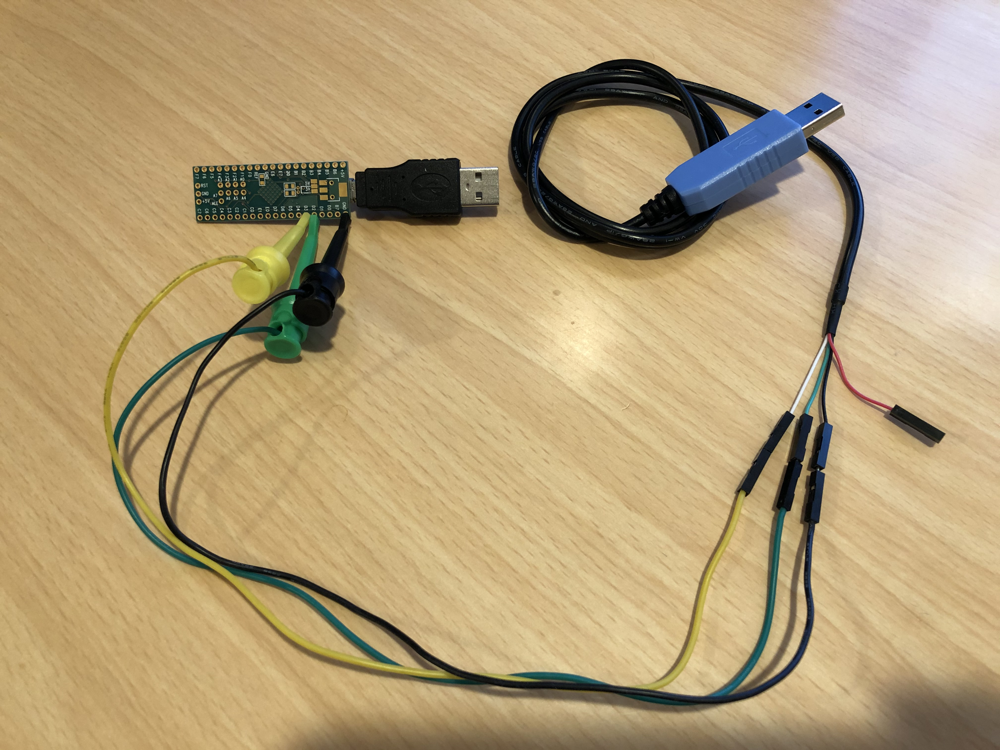
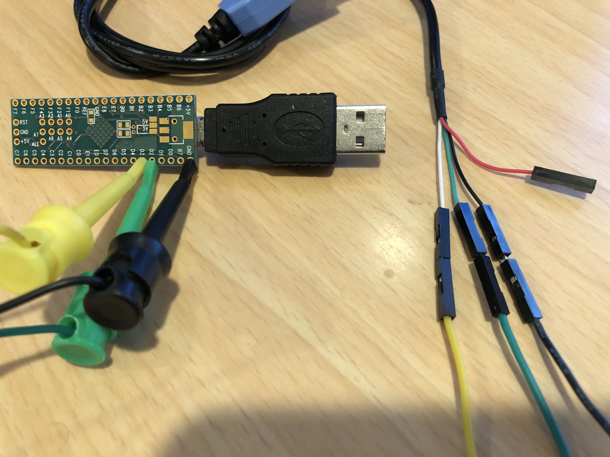
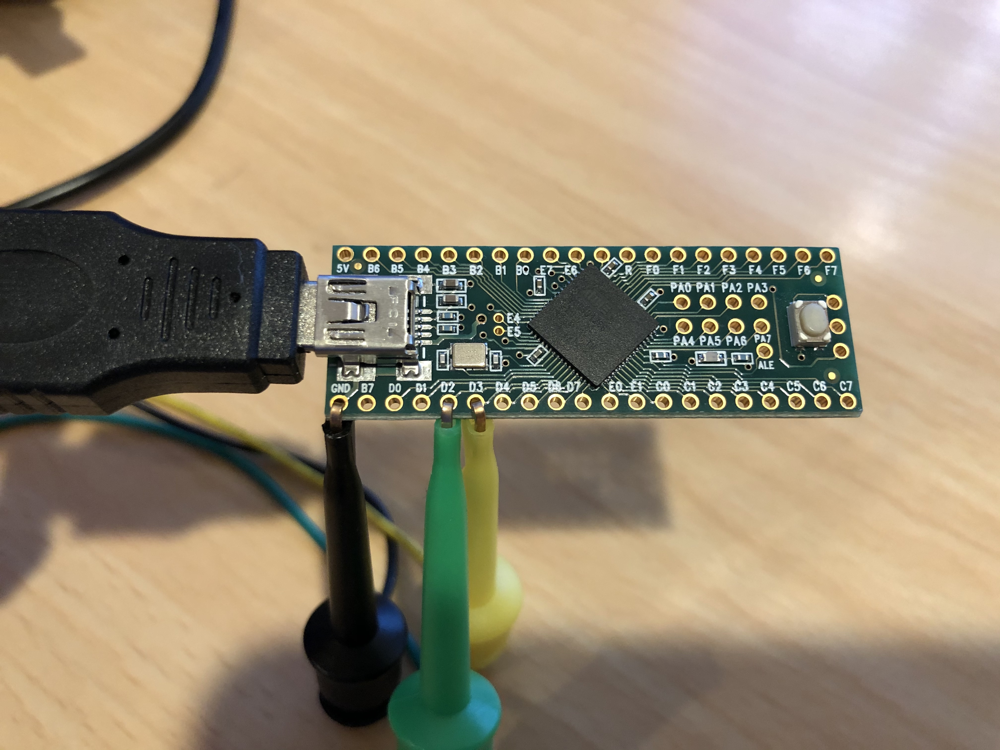

# Serial Communication

*Serial communication is an optional extension to the programs here. It requires additional hardware.*

Starting from version 20201216, this package has had support for some sort of serial connection.

Serial connection allows the Arduino/Teensy to communicate with a computer. This opens up new possibilities such as:
- **Feedback Automation:** The computer can utilize video and sound capture information.
- **Information Logging:** Existing programs can send progress and status updates for a computer to display.

As of this writing, serial communication is a new initiative and there isn’t much that is production-ready. Some of the programs in this package will broadcast status information to the computer:
- Day skippers will log the # of skips remaining.
- Autohosts will log the # of raids hosted.
- Date-spam farmers will log the # of farm attempts.
- Shiny hunting programs will log the # of attempted encounters.
- Egg fetching will log the # of fetch attempts.

However, serial communication requires additional hardware. Below is a simple example using a Teensy. The Teensy plugs into the Switch while the blue USB plug goes into a computer.

*Much of this is still in development. For the latest, head over to our Discord server.*

## Application Examples:
The device logger can display the number remaining skips for the day skippers.

There is also a [working prototype program](https://github.com/ercdndrs/AutoMaxLair) that automates the Dynamax Adventures. (Details are available in our server.)

## Hardware and Setup:

As mentioned above, additional hardware is needed for serial communication. Here is what you will need to upgrade your existing Arduino/Teensy setup into one that can do serial communication.

*Note that there are many setups that work. The list here is meant for beginners without soldering. If you already know what you’re doing, feel free to laugh at this and do whatever you want.*

**Arduino and Teensy:**
- A USB-to-TTL UART Cable. (https://www.adafruit.com/product/954)
It is recommended to get one with the CP210x controller. Avoid the ones with PLxxxx controllers since many of them are knock-offs that do not work.
- Male-to-male jumper wires. (https://www.amazon.com/gp/product/B01EV47GI4/)

 

**Teensy Only:**
- Mini grabber to jumper wires. (https://www.amazon.com/gp/product/B08M5GNY47)

These mini grabber cables may come in either male or female wire variants. Male is preferred since they plug directly into the UART cable and thus do not require male-to-male jumper cables.
The purpose of these mini grabber cables is to grip the holes of the Teensy and make electrical contact without solder.

**Other Options: UART Cables**

The Adafruit UART cable is reliable and beginner-friendly, but it is also quite expensive. If you are experienced (or confident), here are some cheaper alternatives which also work. These may require a trivial amount of extra wiring.
- https://www.amazon.com/gp/product/B07D6LLX19/ (2 for $8)
- https://www.amazon.com/gp/product/B089SMS6MN (4 for $10)
- https://www.amazon.com/dp/B072K3Z3TL (1 for $8)

Anything with the CP210x controllers should work. But the ones above have been explicitly tested.

**Other Options: Mini Grabbers for Teensy**

For Teensy users, the mini grabber cables suggested above seems to be out-of-stock more often than not. You can use two-sided mini-grabber cables instead (which are much easier to find), but they lead to a messier setup.

An alternative to mini grabbers are solderless headers: (https://www.adafruit.com/product/3662)

### Arduino Uno R3

Make the following connections:
- UART cable green (TX) to Arduino pin1 (TX -> 1)
- UART cable white (RX) to Arduino pin0 (RX <- 0)
- UART cable black (GND) to Arduino GND (anyone one is fine)
- UART cable red (VCC) – leave unconnected

 

### Teensy 2.0

Make the following connections:
- UART cable green (TX) to Teensy D2 (RX)
- UART cable white (RX) to Teensy D3 (TX)
- UART cable black (GND) to Teensy GND (anyone one is fine)
- UART cable red (VCC) – leave unconnected

Note that the mini grabber clips will not fit through the holes on the Teensy. This is fine.

 

### Teensy++ 2.0

Make the following connections:
- UART cable green (TX) to Teensy D2 (RX)
- UART cable white (RX) to Teensy D3 (TX)
- UART cable black (GND) to Teensy GND (anyone one is fine)
- UART cable red (VCC) – leave unconnected

Note that the mini grabber clips may not fit through the holes on the Teensy. This is fine.

 

## Software Setup:

We currently do not yet have a standardized software setup as this is still a work in progress.

As of this writing, there are two separate projects which utilize serial using two different software stacks.

### PABotBase:

Pokémon Bot Base is a framework based on this package that allows programs to be written in C++ for a computer to run on the Arduino/Teensy. It supports the same programming and button pressing API on both computer and device. Therefore, programs written for one can be compiled to run on the other.

Currently, there are only a handful of programs that use PABotBase. These, along with the entire PC-side of the PABotBase framework are open-sourced and can be found on the main repo.

The "Device Logger" program will connect to any of the programs in this package and print out status information about them.

The PC-side of PABotBase (PABotBase client) has no official releases yet since it is still early in development and there are no significant programs yet. A Windows binary is provided for Windows. For everything else, you must build from source. Support is currently maintained for Windows and Linux.

### AutoMaxLair:

AutoMaxLair is a program that automates the Dynamax Adventures. It is written by MrDonders and can be found both on GitHub and inside our Discord server. (https://github.com/ercdndrs/AutoMaxLair)

It is written in Python and uses a lightweight framework to interface with the Arduino/Teensy. It utilizes video capture to interpret battle information and has its own AI to play the Dynamax Adventures.

