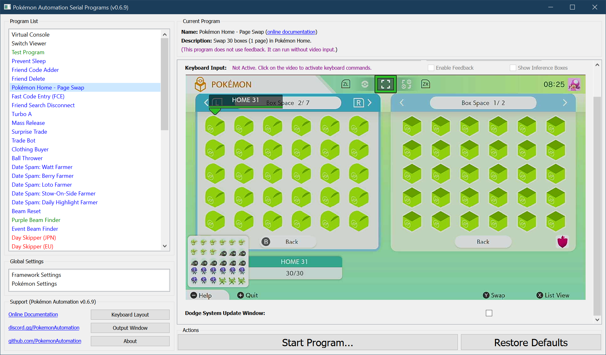

# Pokémon Home - Page Swap

Swap one page (30 boxes) in Pokémon Home with your Sword/Shield game.

This program can also be used on the last (incomplete) page of Pokémon Home as long as you manually stop the program early.

## Instructions:
- Have Pokémon home in the following configuration. (see below)
  - Both panels are viewing boxes.
  - Your cursor is on the left panel over the upper-left most box.
- Start the program in the [Change Grip/Order Menu](../Appendix/ChangeGripOrderMenu.md).

## Options:

### Dodge the System Update Window:

When set to true, the program will dodge the system update window. Do not set this option if the system update window is not present. Unlike other programs, this program will not be able to tolerate the extra button presses if they land in the box system.

**Back to:**
- [Project Home](/README.md)
- [Program List](/Documentation/ProgramList.md)

**Discord Server:** 

