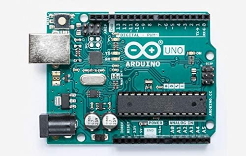
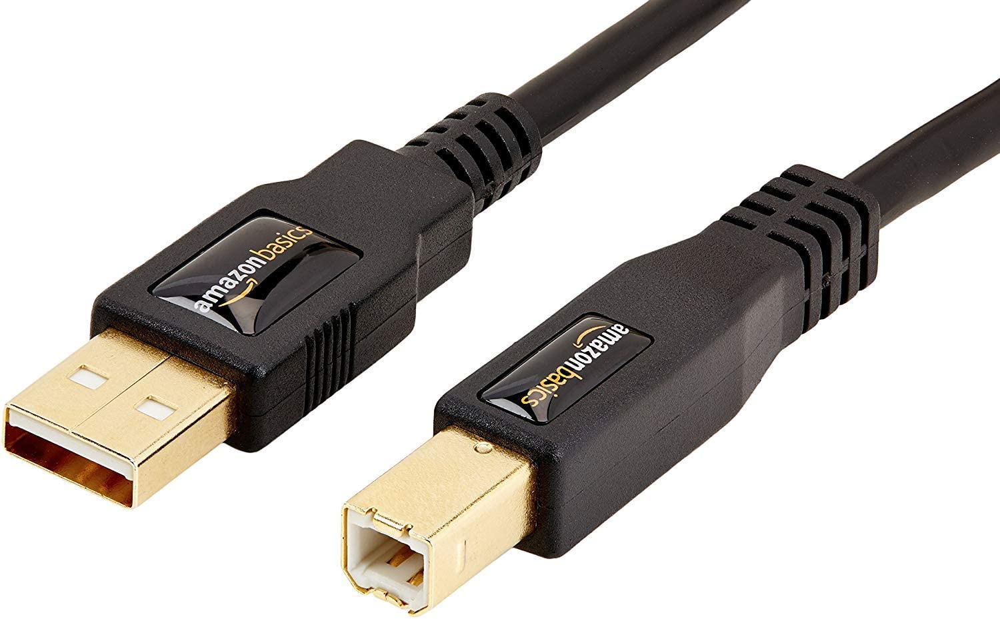

# Hardware - Arduino Uno R3

This section covers the required hardware for users who have chosen the Arduino Uno R3.

***Note that Arduino Uno R3 is officially deprecated and is no longer recommended.***
1. The Uno R3 and its knock-offs do not have enough memory or flash storage to run all the programs in this project.
2. Many of the Uno R3's that are sold cannot be put into DFU mode. Therefore you cannot program them and they cannot be used.
3. Driver support for the Uno R3 is very flaky. Sometimes it works out-of-box. Other times, it requires manually driver installation.
4. The Uno R3 is complicated to use as it requires manually shorting pins and multiple actions on the computer. By comparison, [Teensy](
Hardware-Teensy2.md ) has a button that does all this.

***(You have been warned.)***

There are 3 levels of hardware setups here. How far you get into this tutorial will depend on which level you wish to achieve.

1. **Basic Programs:** No computer control. No feedback. ([Basic Hardware](#basic-hardware) only)
2. **Serial Programs:** Computer control. No feedback. ([Basic Hardware](#basic-hardware) + [Serial Hardware](#serial-hardware))
3. **Full Feedback:** Computer control with video feedback. (everything in this tutorial - all the way to the end)

# Basic Hardware:

At minimum, you will need the following components:

1. [Arduino Uno R3](https://store.arduino.cc/usa/arduino-uno-rev3)
2. USB-A male to USB-B male cable. ([example](https://www.amazon.com/Monoprice-1-5-Feet-24AWG-Plated-105436/dp/B009GUVZOK))

 

**Switch Lite users will also need:**

1. A USB hub or portable dock. ([example](https://www.amazon.com/gp/product/B07JK9DFKH))

The Switch Lite does not have a USB-A port. Therefore you need either an adapter or a hub to connect the Teensy. A charging hub or dock is required to simultaneously charge and use the Teensy.

Portable docks will work for the Switch Lite. It will just not be able to output video over the HDMI.

**Optional Hardware:**

If you will be using the [FastCodeEntry](../Programs/FastCodeEntry.md) program or if you are a heavy user in general, then it is strongly recommended to get a USB-A male-to-female cable with a power switch on it. ([example](https://www.amazon.com/gp/product/B07T9BRNHW))

If you intend to change programs very often and will be running the Switch next to a computer, then you will want a USB switch. ([example](https://www.amazon.com/gp/product/B006Z0Q2SI)) These are like USB-only KVM switches. In fact a regular KVM switch will also work. With this, you no longer have to constantly plug/unplug USBs which will eventually wear them down.

# Serial Hardware:

To use any of the serial or feedback programs, you will need additional hardware.

There are many ways to set this up with varying cost and difficulty. Here we will present some simple options that do not require soldering. If you are experienced with electronics, feel free to do your own thing.

## Option 1: UART Cable + Jumper Cables

This is the standard setup for the Arduino Uno R3.

**Required Hardware:**
1. Everything from the [previous section](#basic-hardware).
2. A [USB-to-TTL UART cable or board](https://www.adafruit.com/product/954). It is recommended to get one with the CP210x controller. Avoid the ones with PLxxxx controllers since many of them are knock-offs that do not work.
3. Male-to-male jumper wires. (https://www.amazon.com/gp/product/B01EV47GI4/)

 

**Hardware Setup:**

Once you have your hardware, you need to make some connections.

Make the following connections:
- UART cable green (TX) to Arduino pin1 (TX -> 1)
- UART cable white (RX) to Arduino pin0 (RX <- 0)
- UART cable black (GND) to Arduino GND (any one is fine)
- UART cable red (VCC) – leave unconnected

(click to enlarge)

 

## Bulk Alternatives to UART Cable

The Adafruit UART cable is reliable and beginner-friendly, but it is also quite expensive. If you are experienced (or confident), here are some cheaper alternatives which also work. These may require a trivial amount of extra wiring.
- https://www.amazon.com/gp/product/B07T1XR9FT (4 for $8)
- https://www.amazon.com/gp/product/B07D6LLX19/ (2 for $8)
- https://www.amazon.com/dp/B072K3Z3TL (1 for $8)

These red CP210x boards seem to be the most popular in our server due to their cost.

# Video Hardware:

Main Section: [Video Hardware](Hardware-Video.md)

