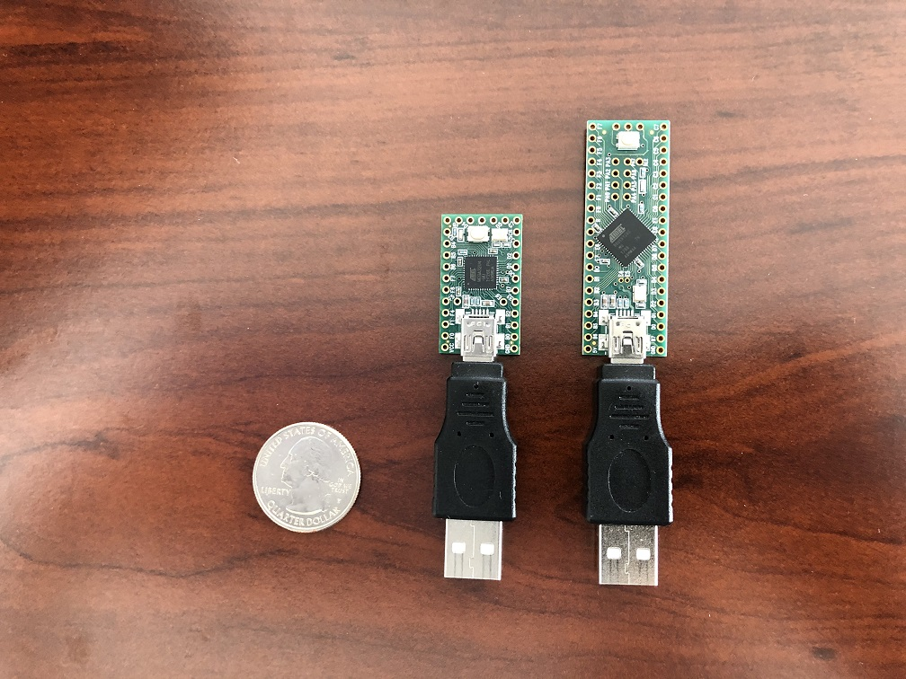
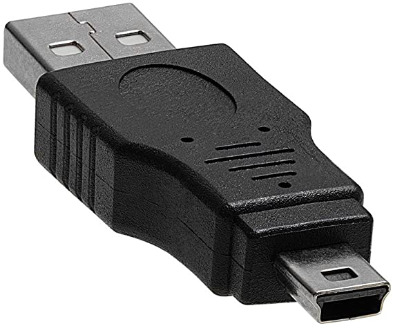

# Hardware - Teensy 2.0 and Teensy++ 2.0

This section covers the required hardware for users who have chosen Teensy 2.0 or Teensy++ 2.0.

There are 3 levels of hardware setups here. How far you get into this tutorial will depend on which level you wish to achieve.

1. **Basic Programs:** No computer control. No feedback. ([Basic Hardware](#basic-hardware) only)
2. **Serial Programs:** Computer control. No feedback. ([Basic Hardware](#basic-hardware) + [Serial Hardware](#serial-hardware))
3. **Full Feedback:** Computer control with video feedback. (everything in this tutorial - all the way to the end)

# Basic Hardware:

The basic Teensy hardware setup will look like this:

**Required Hardware:**

1. [Teensy 2.0](https://www.pjrc.com/store/teensy.html) or [Teensy++ 2.0](https://www.pjrc.com/store/teensypp.html)
2. Mini-USB male to USB-A male cable or adapter. ([example](https://www.amazon.com/Cmple-Pack-Male-5-Pin-Adapter/dp/B00A1PH0ZW))

 

If you intend to use multiple Teensys, we strongly recommend getting the 10-pack for the adapters since it is more cost effective.
If you will be using the [Pro Micro board](Hardware-ProMicro.md) as well, then [get this instead](https://www.amazon.com/gp/product/B081HDS3WB).

**Switch Lite users will also need:**

1. A USB hub or portable dock. ([example](https://www.amazon.com/gp/product/B07JK9DFKH))

The Switch Lite does not have a USB-A port. Therefore you need either an adapter or a hub to connect the Teensy. A charging hub or dock is required to simultaneously charge and use the Teensy.

Portable docks will work for the Switch Lite. It will just not be able to output video over the HDMI.

**Optional Hardware:**

If you will be using the [FastCodeEntry](../Programs/FastCodeEntry.md) program or if you are a heavy user in general, then it is strongly recommended to get a USB-A male-to-female cable with a power switch on it. ([example](https://www.amazon.com/gp/product/B07T9BRNHW))

If you intend to change programs very often and will be running the Switch next to a computer, then you will want a USB switch. ([example](https://www.amazon.com/gp/product/B006Z0Q2SI)) These are like USB-only KVM switches. In fact a regular KVM switch will also work. With this, you no longer have to constantly plug/unplug USBs which will eventually wear them down.

### Teensy 2.0 or Teensy++ 2.0?

Teensy++ 2.0 is more powerful and expensive than the Teensy 2.0.

Since Teensy 2.0 is sufficient for the programs in this project, there is no reason to get Teensy++ 2.0 unless they are nearly the same price.

# Serial Hardware:

To use any of the serial or feedback programs, you will need additional hardware.

There are many ways to set this up with varying cost and difficulty. Here we will present some simple options that do not require soldering. If you are experienced with electronics, feel free to do your own thing.

It is worth noting that the most difficult part of the serial setup is connecting to the holes on the Teensy.
This can be made much easier by purchasing a Teensy with pins, but this is not recommended unless you plan on keeping the Teensy in a breadboard as it is too easy to damage or short the pins.

## Option 1: UART Cable + Mini-Grabber Cables

This option is the easiest to setup, however the mini grabber cables that are needed are rarely in stock.

 

**Required Hardware:**
1. Everything from the [previous section](#basic-hardware).
2. A [USB-to-TTL UART cable or board](https://www.adafruit.com/product/954). It is recommended to get one with the CP210x controller. Avoid the ones with PLxxxx controllers since many of them are knock-offs that do not work.
3. [Mini grabber to jumper wires (male).](https://www.amazon.com/gp/product/B08M5GNY47) You want the one with ***male*** jumper wires.

 

**Hardware Setup:**

Once you have your hardware, you need to make some connections. These are the same for both Teensy 2.0 and Teensy++ 2.0, but the locations of the holes are different. Refer to the images.

Make the following connections:
- UART cable green (TX) to Teensy D2 (RX)
- UART cable white (RX) to Teensy D3 (TX)
- UART cable black (GND) to Teensy GND (any one is fine)
- UART cable red (VCC) – leave unconnected

Note that the mini grabber clips may not fit through the holes on the Teensy. This is fine.

**Teensy 2.0:** (click on images to enlarge)

 

**Teensy++ 2.0:** (click on images to enlarge)

 

## Option 2: UART Cable + Solderless Hammer Headers

This option is cleaner, but is more involved.

 

**Required Hardware:**
1. Everything from the [previous section](#basic-hardware).
2. A [USB-to-TTL UART cable or board](https://www.adafruit.com/product/954). It is recommended to get one with the CP210x controller. Avoid the ones with PLxxxx controllers since many of them are knock-offs that do not work.
3. [Solderless Hammer Headers](https://www.adafruit.com/product/3662)
4. A box cutter or a wire cutter.
5. Pliers. (you will likely need two of them)

**Hardware Setup:**

1. Use your box cutter or wire cutter to cut out 2 pairs of pins from the strip of solderless headers. ***Be very careful not to cut yourself.***
2. Insert a pair of hammer headers into the D2 and D3 holes on the Teensy.
3. Insert a hammer header into the GND hole on the Teensy. (Since you can't easily split the pair of pins, you can do GND and the pin adjacent to it.)

 

On Teensy 2.0, you need a LOT of force to push the hammer headers into the holes. Recommend using pliers to pull the pins out of the plastic holds and inserting the long side into the Teensy. Then put the covers back on and use pliers to squeeze it in.

Now that the pins are setup, you can make the connections. These are the same for both Teensy 2.0 and Teensy++ 2.0, but the locations of the holes are different. Refer to the images.

You will need to make the following connections:
- UART cable green (TX) to Teensy D2 (RX)
- UART cable white (RX) to Teensy D3 (TX)
- UART cable black (GND) to Teensy GND (any one is fine)
- UART cable red (VCC) – leave unconnected

 

## Bulk Alternatives to UART Cable

The Adafruit UART cable is reliable and beginner-friendly, but it is also quite expensive. If you are experienced (or confident), here are some cheaper alternatives which also work. These may require a trivial amount of extra wiring.
- https://www.amazon.com/gp/product/B07T1XR9FT (4 for $8)
- https://www.amazon.com/gp/product/B07D6LLX19/ (2 for $8)
- https://www.amazon.com/dp/B072K3Z3TL (1 for $8)

These red CP210x boards seem to be the most popular in our server due to their cost.

# Video Hardware:

Main Section: [Video Hardware](Hardware-Video.md)

