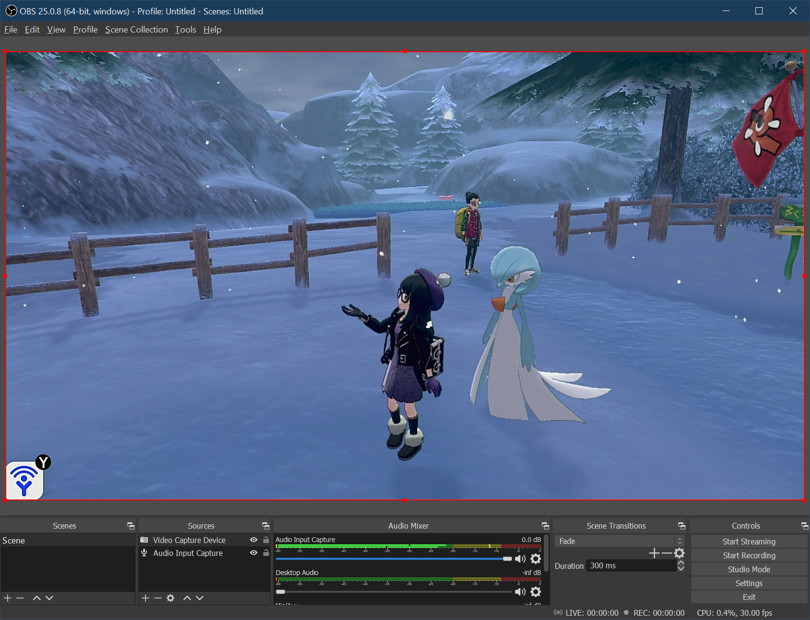

# Video Hardware:

The video capture hardware is separate from the device controller emulation. Therefore it's the same for all devices.

**Required Hardware:**

1. A video capture card. ([example](https://www.amazon.com/gp/product/B08FC3JCL5))
2. HDMI cable(s)

There are a wide variety of capture cards with a large range of prices.
- The cheapest ones can be less than $10, but have no passthrough, are limited to USB 2.0 bandwidth, and have video quality issues.
- The more expensive ones can be over $100. These support passthrough and use USB 3.0 or PCIe. These are meant for livestreaming.

For the purposes Pokémon automation, the cheapest capture cards appear to be sufficient. But if you want a tolerable video quality you'll want one that uses USB 3.0. And if you want to display the video both on your TV and in your computer, you will need one with passthrough. Each of these will add to the cost.

In short, this won't be a full guide on capture cards. You can do your own research on that.

**Capture card without passthrough:** Can only display video within the computer.

**Capture card with passthrough:** Display video both on TV and in your computer.

Regardless of what capture card you choose, you will need either 1 or 2 HDMI cables to connect them to your Switch and/or your TV.

## Software Setup

This step is optional since it isn't needed for Pokémon automation, but recommended anyway for everyone who has a video capture device.

Once you have your video hardware, download and install [OBS](https://obsproject.com/download). Learn how to use OBS, as it's the standard for streaming recording and will be useful for troubleshooting your hardware setup. Aside from streaming their gameplay, many users use OBS to record their shiny hunts to determine if a shiny is star or square before deciding whether to catch it or pass it up.

This guide will not go into detail on how to use OBS. There should be plenty of other online resources for that.

**Back to:**
- [Project Home](/README.md)
- [Documentation Home](/Documentation/README.md)

**Discord Server:** 

