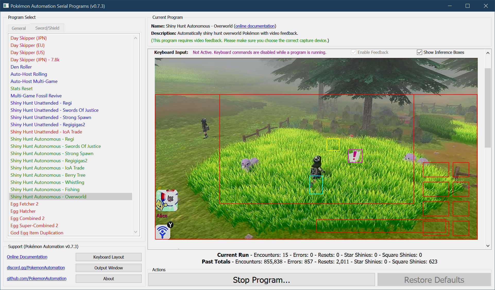

# Pokémon Automation Sword/Shield Arduino Scripts

Welcome to Pokémon Automation's official GitHub group. This is the distribution repo for our Arduino programs for Pokémon Sword/Shield.

**Latest Downloads:**
- **Native Programs:** [PA-NativePrograms-0.5.2-20210630.zip](PA-NativePrograms-0.5.2-20210630.zip?raw=true)
- **Serial Programs:** [PA-SerialPrograms-0.7.12-20210630.zip](PA-SerialPrograms-0.7.12-20210630.zip?raw=true)

**Links:**
- [Getting Started + Setup Tutorials](Documentation/Tutorials/README.md)
- [Program List](Documentation/ProgramList.md)
- [Version History](Documentation/VersionHistory.md)

The latest releases and betas are in the discord server. This repo is merely a mirror that isn't always up-to-date.

## What is this?

Pokémon Automation is a project that strives to automate the Pokémon games. This particular repo is for Pokémon Sword and Shield.

### Why automate the game?

Certain aspects of Pokémon are very boring and tedious (such as shiny hunting). So rather than spending hundreds of hours grinding with manual gameplay, you have a bot do it for you. Thus the fun changes to managing the bots that play the game for you.

With automation, it becomes possible to play 24/7 and simultaneously on multiple devices without wasting too much of your own time. Thus with so much extra game time, it becomes possible to legitimately obtain extremely rare Pokémon that are normally only feasible via hacking.

### How does this work?

The Nintendo Switch allows the use of 3rd party wired controllers. But instead of using an actual game controller, we emulate a controller using a microcontroller such as an Arduino. This microcontroller can then be programmed to send button presses to the Switch. Once programmed, all that is needed is to plug the microcontroller into your Switch's USB port just like any handheld controller and watch it do its thing.

This approach is not new. Many other Switch automation projects did the same thing long before this project existed.

### What does this project do differently than other similar projects?

As of this writing, the vast majority of similar projects are based off of the [Splatoon proof-of-concept](https://github.com/progmem/Switch-Fightstick) and use only a single microcontroller to control the Switch.

Since these programs reside entirely on the microcontroller, they are limited in size, complexity, and cannot utilize sound or visual feedback from the Switch. Thus these programs are small and are completely blind. Button presses are done entirely on timer with no way to respond to events in the game.

We call these programs, "Native Programs" - since they run entirely on the microcontroller.

Like other projects, we have our own comprehensive set of native programs for Pokémon Sword/Shield:
- Auto-hosting
- Watt and other forms of farming.
- Egg hatching
- Unattended shiny-hunting.
- much more... [click here for complete list.](Documentation/ProgramList.md)

But of course, that's not what you're interested in right?

In addition to the classic "native" programs, we also have "serial" programs. Serial programs work by connecting the microcontroller to the computer over a serial connection. This allows a computer to control the Switch.

What does connecting to a computer provide? For starters:
1. Much larger and more sophisticated programs that cannot fit onto a microcontroller.
2. The ability to play your Switch from your computer using a keyboard. (and thus remotely through remote control software)
3. The ability to control multiple Switches simultaneously in a single program.
4. The ability to use feedback from video capture card.

With serial and video feedback, the computer can play the game just like a human does. It watches the screen and presses buttons in response to events that it sees.

As you can probably guess, the techniques involved are no longer trivial. Visual recognition will inevitably involve machine learning and game play decisions may require some forms of artificial intelligence. But as the user, you don't need to know any of that. You get to enjoy the automation directly.

## Demo Videos:

Curious? Here are some demos for what our set of programs can do!

**Native Programs:**

These programs are flashed directly to the microcontroller and are run natively from it.

- [7800/hour JPN Date Skipper](https://cdn.discordapp.com/attachments/755635697737531544/755637307167735888/DaySkipperJPN-7.8k.mov)
- [7500/hour EU Date Skipper](https://cdn.discordapp.com/attachments/755635697737531544/755638422558736434/DaySkipperEU-7.5k.mov)
- [Unattended Shiny Hunting](https://cdn.discordapp.com/attachments/755635697737531544/772244388109090817/ShinyTerrakion.mp4)
- [1 million watts/hour Watt Farmer](https://cdn.discordapp.com/attachments/755635697737531544/755640509376233522/WattFarmer.mov)
- [Fast Code Entry - Enter any 8-digit code in half a second.](https://cdn.discordapp.com/attachments/755635697737531544/755642709183561789/FastCodeEntry.mov)
- [Rolling Auto-Host](https://cdn.discordapp.com/attachments/755635697737531544/755891856172253194/RollingAutoHost.mov)

**Serial Programs:**

These programs run on a computer and control your Switch over serial connection.

- [Auto-Fishing](https://cdn.discordapp.com/attachments/755635697737531544/823709108150075412/2021-03-22_19-04-14.mp4)
- [Overworld Encounter Bot (Authentic Sinistea)](https://cdn.discordapp.com/attachments/780505858613837835/842199538440732672/Shiny_Authentic_Sinistea.mp4)
- [Friend Code Adder](https://cdn.discordapp.com/attachments/755635697737531544/810360426784227348/FriendCodeAdder.mov)
- [Multi-Switch Candy Farming](https://cdn.discordapp.com/attachments/755635697737531544/814164114305581106/Candy_Farmer.mov)
- [Purple Beam Finder](https://cdn.discordapp.com/attachments/755635697737531544/817957563287076864/PurpleBeamFinder.mp4)
- [Tool-Assisted Raid Entry](https://cdn.discordapp.com/attachments/755635697737531544/809314697476046898/Serial_-_FCE.mov)
- [Setting up a program remotely without touching your Switch.](https://cdn.discordapp.com/attachments/755635697737531544/809314602638770176/Serial_-_Regi_Setup.mov)

## Program List:

[See main article.](Documentation/ProgramList.md)

## Performance Comparisons

| **Program** | **PA's SwSh Scripts (this package)** | **[brianuuuSonic's Autocontroller](https://github.com/brianuuu/AutoController_swsh)** |
| --- | --- | --- |
| [Day Skipper (JPN)](Documentation/NativePrograms/DaySkipperJPN-7.8k.md) | 7827 skips/hour (7.8k) 7619 skips/hour (original) | 6500 skips/hour (fast mode) 6134 skips/hour (default mode) |
| [Day Skipper (EU)](Documentation/NativePrograms/DaySkipperEU.md) | 7541 skips/hour (year 2020) 7533 skips/hour (year 2021) | 5006 skips/hour (fast mode) 4786 skips/hour (default mode) |
| [Day Skipper (US)](Documentation/NativePrograms/DaySkipperUS.md) | 7180 skips/hour (year 2020) 7173 skips/hour (year 2021) | 5006 skips/hour (fast mode) 4786 skips/hour (default mode) | 
| [Watt Farming](Documentation/NativePrograms/DateSpam-WattFarmer.md) | 6.9 seconds/fetch | 9.1 seconds/fetch|
| [Berry Farming](Documentation/NativePrograms/DateSpam-BerryFarmer.md) | 13.1 seconds/fetch | 16.0 seconds/fetch|
| [Loto ID](Documentation/NativePrograms/DateSpam-LotoFarmer.md) | 18.4 seconds/attempt | 20.5 seconds/ attempt|
| [Den Rolling](Documentation/NativePrograms/DenRoller.md) | 16.4 seconds/skip | 18.0 seconds/skip|
| [Sustained Egg Hatching (5120 step)](Documentation/NativePrograms/EggCombined2.md) | 1700 eggs/day (2-3 touches/day) | 1300 eggs/day (~6 touches/day)
| [8-Digit Code Entry](Documentation/NativePrograms/FastCodeEntry.md) | ~0.5 seconds | up to 6.3 seconds |

## Contributors
- Mysticial - Project founder.
- SakuraKim - Release management, development, and R&D.
- denvoros - Build scripts, Mac support, and AI R&D.
- MrDonders - R&D
- joyrida - Build scripts and Mac support.

And countless users and testers in the Pokémon Automation Discord Server.

## History

This project was originally started by Mysticial back in March 2020 as a stand-alone project to add a bunch of functionality that was missing from v3.1.0 of brianuuuSonic's AutoController programs. Since then, the project has been handed over to the Pokémon Automation discord server which now continues its development. Mysticial, the author of first few programs remains part of the development team – but only as a secondary/advisory role.

As of this writing, Pokémon Automation's Arduino programs have been developed independently. With the exception of the LUFA library and the low-level USB descriptors, this project shares no code with and bears no resemblance to any other Arduino Switch programs.

## Supporting Us

As of this writing, we do not take donations of any kind for this project. The only support we request is by sharing our work with your friends if you have enjoyed using it.
In the spirit of transparency, we kindly ask that you disclose the use of automation when sharing photos or videos of Pokémon obtained using these programs.
This can be done simply by sharing a screenshot of the program with stats or with a text footer indicating it is done by automation.

If such a disclosure is not permissible, we ask that you avoid any explicit or implicit claims that such Pokémon were caught manually.

## License

You are free to use and distribute this original package for personal use only.

Do not try to profit off of these programs. It's just a game; keep the money out of it and have fun.

For all other uses, please reach out to the administrators of the Pokémon Automation discord server.

This software is provided "as is" and the developers disclaim all warranties with regard to this software including all implied warranties of merchantability and fitness. In no event shall the developers be liable for any special, direct, indirect, or consequential damages, or any damages whatsoever resulting from loss of use, data or profits, whether in an action of contract, negligence or other tortious action, arising out of or in connection with the use or performance of this software.

